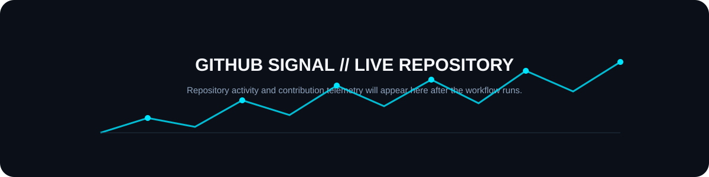

<div align="center">


<br>

<a href="https://github.com/Subhajit054"></a>
<a href="https://creative-vision-studio.vercel.app/"></a>
<a href="https://www.linkedin.com/in/subhajit04sen"></a>
<a href="https://leetcode.com/u/jitsubha04/"></a>
<a href="https://www.kaggle.com/subhaji04"></a>
<a href="mailto:jitsen5849@gmail.com"></a>

</div>

---

> **The goal isn't to collect technologies. The goal is to make every technology earn its place in a system.**

## `01 // SYSTEM IDENTITY`

<table>
<tr>
<td width="52%" valign="top">

### SUBHAJIT SEN

**B.Tech CSE — Artificial Intelligence & Machine Learning**

I build at the intersection of **Artificial Intelligence, Software Engineering and Blockchain**.

I like turning ideas into systems that are:

- 🧠 **Intelligent** — AI, ML, GenAI, RAG, Computer Vision
- ⚡ **Scalable** — full-stack engineering, APIs, cloud and deployment
- ⛓️ **Trust-aware** — blockchain, smart contracts and Web3
- 🧩 **System-driven** — DSA, architecture, trade-offs and engineering fundamentals

**Currently exploring:** LLM applications · RAG · embeddings · vector databases · computer vision · deep learning · full-stack systems · Web3

</td>
<td width="48%" align="center" valign="middle">


</td>
</tr>
</table>

---

## `02 // NEURAL STACK`


### Core technologies

**Languages:** Python · C++ · Java · JavaScript · JSON  
**AI/ML:** Machine Learning · Deep Learning · Computer Vision · NLP · Generative AI · LLMs · RAG · Embeddings  
**AI Engineering:** PyTorch · TensorFlow · LangChain · LangGraph · Vector Databases  
**Full-Stack:** HTML · CSS · JavaScript · React · Next.js · FastAPI · REST APIs  
**Data & Backend:** MongoDB · MySQL · Firebase  
**Cloud & DevOps:** Docker · Git · GitHub Actions · Google Cloud · Vercel  
**Web3:** Solidity · Ethereum · Smart Contracts · ethers.js · MetaMask · dApps

---

## `03 // PROJECT UNIVERSE`


### Selected builds

| Project | Focus |
|---|---|
| 🩸 **BloodGrid** | Blockchain × Healthcare × Real-Time Emergency Systems |
| 🧠 **MedSwap AI** | Computer Vision × NLP × Prescription Understanding |
| 🛰️ **Satellite AI** | Deep Learning × Computer Vision × Image Classification |
| 🔐 **Decentralized Document Vault** | Blockchain × Digital Ownership × Verification |
| 🎨 **Crafts Marketplace** | Full-Stack × E-Commerce × Rural Innovation |
| 🧩 **Cortex / Intelligent Systems** | GenAI × RAG × Knowledge Systems |

---

## `04 // ENGINEERING MINDSET`


<div align="center">

**AI gives systems intelligence.**  
**Software gives them scale.**  
**Blockchain gives them trust.**

</div>

---

## `05 // GITHUB SIGNAL`

<div align="center">



</div>

> The telemetry layer is intentionally repository-hosted. Run the included GitHub Action to generate your personal statistics without depending on fragile external image endpoints.

---

## `06 // DEVELOPER TRAJECTORY`

```text
2023 ── B.Tech CSE (AI & ML)
   │
2024 ── Programming · Web Development · Software Fundamentals
   │
2025 ── Machine Learning · Deep Learning · Computer Vision · Blockchain
   │
2026 ── Generative AI · RAG · Full-Stack · Web3 · System Engineering
   │
2027 ── AI / Software Engineer
```

---

## `07 // BUILD PHILOSOPHY`

```text
PROBLEM
   ↓
UNDERSTAND
   ↓
DESIGN THE SYSTEM
   ↓
CHOOSE TECHNOLOGY WITH A REASON
   ↓
BUILD
   ↓
TEST
   ↓
DEPLOY
   ↓
LEARN
   ↺
```

I don't want to simply know **how** a technology works.

I want to understand **when it belongs in a system, why it belongs there, and what trade-offs it introduces.**

---

## `08 // CONNECT`

<div align="center">

**Building at the intersection of AI × Software × Web3.**

<br>

<a href="https://creative-vision-studio.vercel.app/">Portfolio</a> ·
<a href="https://www.linkedin.com/in/subhajit04sen">LinkedIn</a> ·
<a href="https://leetcode.com/u/jitsubha04/">LeetCode</a> ·
<a href="https://www.kaggle.com/subhaji04">Kaggle</a> ·
<a href="mailto:jitsen5849@gmail.com">Email</a>

<br><br>

`BUILD WHAT'S NEXT.`

</div>
