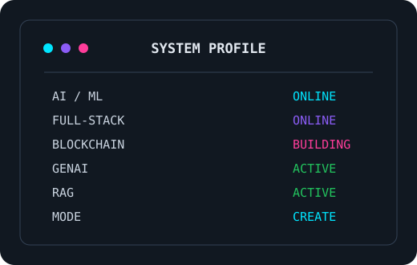
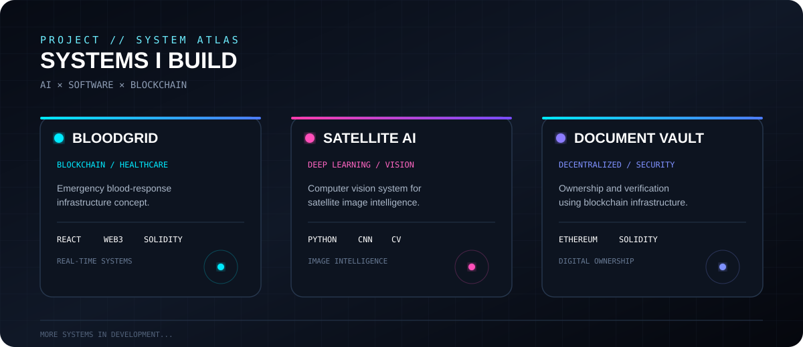
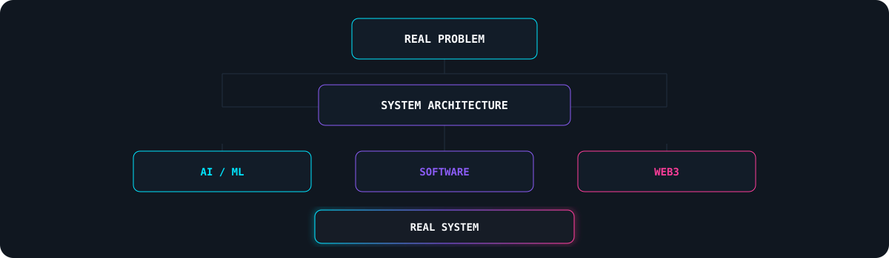
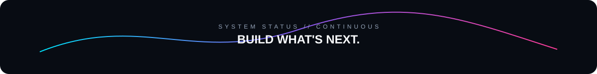

 

  

---

## `01 // IDENTITY`

<table>
<tr>
<td width="58%" valign="top">

### SUBHAJIT SEN

**B.Tech CSE — Artificial Intelligence & Machine Learning**

I build at the intersection of **AI, software engineering and blockchain**.

My goal is not to collect technologies.

My goal is to understand **why a technology belongs in a system**, then use it to solve a meaningful problem.

> **Build the system. Understand the trade-offs. Make the technology earn its place.**

**CURRENT FOCUS**

- Generative AI & LLM applications
- RAG, embeddings & vector databases
- Computer Vision & Deep Learning
- Full-stack application engineering
- Blockchain & Web3 systems
- DSA, system design & software engineering

</td>
<td width="42%" valign="middle" align="center">

</td>
</tr>
</table>

---

## `02 // NEURAL_STACK`

### 🧠 AI / ML

`Machine Learning` · `Deep Learning` · `Computer Vision` · `NLP` · `Generative AI` · `LLMs` · `RAG` · `Embeddings` · `Vector DB` · `LangChain` · `LangGraph`

### ⚡ SOFTWARE ENGINEERING

`REST APIs` · `Frontend` · `Backend` · `Cloud` · `Deployment` · `System Design`

### ⛓ WEB3

`Smart Contracts` · `Ethereum` · `Web3` · `dApps` · `MetaMask` · `ethers.js`

---

## `03 // PROJECT_UNIVERSE`

### 🩸 BloodGrid — Emergency Blood Response OS
**BLOCKCHAIN × HEALTHCARE × REAL-TIME SYSTEMS**

A decentralized emergency blood-response concept connecting donors, hospitals, blood availability and emergency logistics.

**Core:** React · Web3 · Solidity · Smart Contracts · Maps · Real-Time Tracking

---

### 🛰️ Satellite AI
**DEEP LEARNING × COMPUTER VISION**

A deep-learning project focused on understanding and classifying satellite imagery.

**Core:** Python · Deep Learning · Computer Vision · Image Classification

---

### 🔐 Decentralized Document Vault
**BLOCKCHAIN × DIGITAL OWNERSHIP × SECURITY**

A decentralized document architecture exploring ownership, verification and controlled access using blockchain infrastructure.

**Core:** Blockchain · Smart Contracts · Web3

---

### 🎨 Crafts Marketplace
**FULL-STACK × E-COMMERCE × RURAL INNOVATION**

A marketplace concept designed to connect rural artisans with digital customers.

**Core:** Full-Stack Development · UI/UX · E-Commerce

---

### 🌐 More builds
Explore the complete project collection on my **[portfolio](https://creative-vision-studio.vercel.app/)** and **[GitHub](https://github.com/Subhajit054)**.

---

## `04 // ENGINEERING_MINDSET`

**AI gives systems intelligence.**  
**Software gives them scale.**  
**Blockchain gives them trust.**

---

## `05 // GITHUB_TELEMETRY`

  

  

---

## `06 // DEVELOPER_SIGNAL`

  

---

## `07 // CONNECT`

### LET'S BUILD WHAT'S NEXT.

<a href="https://github.com/Subhajit054">GitHub</a> ·
<a href="https://creative-vision-studio.vercel.app/">Portfolio</a> ·
<a href="https://www.linkedin.com/in/subhajit04sen">LinkedIn</a> ·
<a href="https://leetcode.com/u/jitsubha04/">LeetCode</a> ·
<a href="https://www.kaggle.com/subhaji04">Kaggle</a> ·
<a href="mailto:jitsen5849@gmail.com">Email</a>

  

