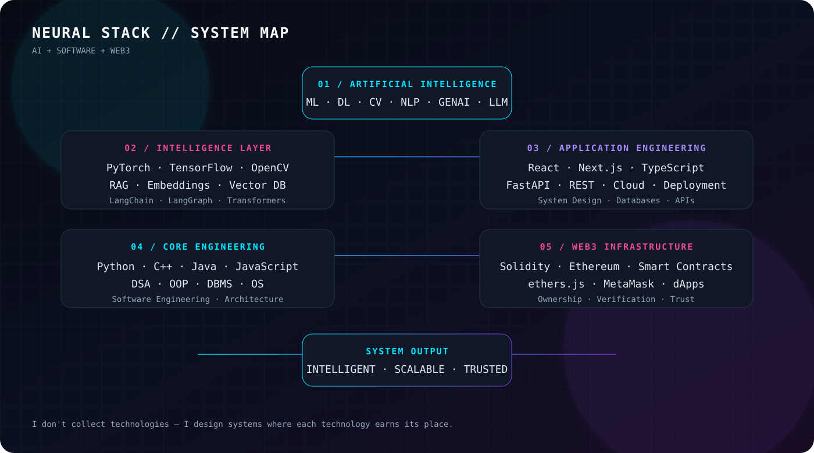
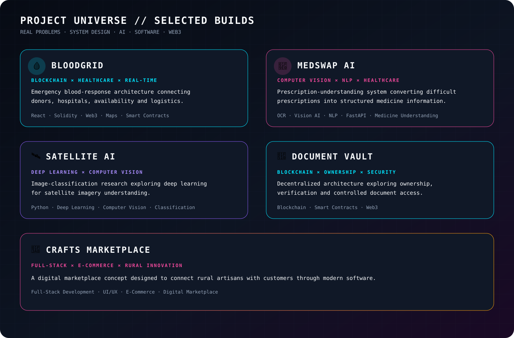

<div align="center">



<br/>

<a href="https://creative-vision-studio.vercel.app/">

</a>
<a href="https://www.linkedin.com/in/subhajit04sen">

</a>
<a href="https://leetcode.com/u/jitsubha04/">

</a>
<a href="https://www.kaggle.com/subhaji04">

</a>
<a href="mailto:jitsen5849@gmail.com">

</a>

<br/><br/>


</div>

---

## `01 // IDENTITY`

<table>
<tr>
<td width="55%" valign="top">

### **SUBHAJIT SEN**

**B.Tech CSE — Artificial Intelligence & Machine Learning**

I build at the intersection of **AI, software engineering and blockchain**.

My goal is not to collect technologies.  
My goal is to understand **why a technology belongs in a system** and use it to solve a meaningful problem.

> **Build the system. Understand the trade-offs. Make the technology earn its place.**

**Current focus**

- Generative AI & LLM applications
- RAG, embeddings & vector databases
- Computer Vision & Deep Learning
- Full-stack application engineering
- Blockchain & Web3 systems
- DSA, system design & software engineering

</td>
<td width="45%" align="center" valign="middle">

```text
┌──────────────────────────────┐
│      SYSTEM PROFILE          │
├──────────────────────────────┤
│                              │
│  AI / ML          ONLINE     │
│  FULL-STACK       ONLINE     │
│  BLOCKCHAIN       BUILDING   │
│  GENAI            ACTIVE     │
│  RAG              ACTIVE     │
│                              │
│  MODE             CREATE     │
│                              │
└──────────────────────────────┘
```

</td>
</tr>
</table>

---

## `02 // THE STACK`

<div align="center">



<br/><br/>

### 🧠 AI / MACHINE LEARNING


<br/>

`Machine Learning` · `Deep Learning` · `Computer Vision` · `NLP` · `Transformers`  
`Generative AI` · `LLMs` · `RAG` · `Embeddings` · `Vector Databases`  
`LangChain` · `LangGraph` · `Model Training` · `Model Evaluation`

<br/><br/>

### ⚡ FULL-STACK ENGINEERING


<br/>

`Frontend` · `Backend` · `REST APIs` · `Authentication` · `Cloud` · `Deployment`  
`System Design` · `Database Design` · `API Integration`

<br/><br/>

### ⛓️ BLOCKCHAIN / WEB3


<br/>

`Solidity` · `Ethereum` · `Smart Contracts` · `Web3` · `dApps` · `MetaMask` · `ethers.js`

<br/><br/>

### 🛠️ TOOLS & INFRASTRUCTURE


<br/>

`Git` · `GitHub` · `Docker` · `MongoDB` · `MySQL` · `PostgreSQL` · `Linux` · `GCP` · `Firebase` · `Vercel`

<br/><br/>

### 💻 PROGRAMMING


</div>

---

## `03 // PROJECT UNIVERSE`

<div align="center">



</div>

### 🩸 BloodGrid — Emergency Blood Response OS

**Blockchain × Healthcare × Real-Time Systems**

A decentralized emergency blood-response concept connecting donors, hospitals, blood availability and emergency logistics.

**Core:** React · Web3 · Solidity · Smart Contracts · Maps · Real-Time Tracking

---

### 🧠 MedSwap AI

**Computer Vision × NLP × Healthcare**

An AI-powered prescription-understanding system designed to transform difficult prescriptions into structured medicine information.

**Core:** OCR · Vision AI · NLP · Medicine Understanding · FastAPI

---

### 🛰️ Satellite AI

**Deep Learning × Computer Vision**

A deep-learning project focused on understanding and classifying satellite imagery.

**Core:** Python · Deep Learning · Computer Vision · Image Classification

---

### 🔐 Decentralized Document Vault

**Blockchain × Digital Ownership × Security**

A decentralized document architecture exploring ownership, verification and controlled access using blockchain infrastructure.

**Core:** Blockchain · Smart Contracts · Web3

---

### 🎨 Crafts Marketplace

**Full-Stack × E-Commerce × Rural Innovation**

A marketplace concept designed to connect rural artisans with digital customers.

**Core:** Full-Stack Development · UI/UX · E-Commerce

---

<div align="center">

<a href="https://creative-vision-studio.vercel.app/">

</a>

</div>

---

## `04 // ENGINEERING MINDSET`

<div align="center">

```text
              ┌─────────────────────┐
              │      REAL PROBLEM   │
              └──────────┬──────────┘
                         │
                         ▼
              ┌─────────────────────┐
              │  SYSTEM ARCHITECTURE│
              └──────────┬──────────┘
                         │
             ┌───────────┼───────────┐
             ▼           ▼           ▼
           AI / ML    SOFTWARE     WEB3
             │           │           │
             └───────────┼───────────┘
                         ▼
              ┌─────────────────────┐
              │     REAL SYSTEM     │
              └─────────────────────┘
```

### **AI gives systems intelligence.**
### **Software gives them scale.**
### **Blockchain gives them trust.**

</div>

---

## `05 // GITHUB TELEMETRY`

<div align="center">


<br/><br/>


<br/><br/>


</div>

---

## `06 // CONTRIBUTION MATRIX`

<div align="center">


</div>

---

## `07 // DEVELOPER STATUS`

<div align="center">

| SYSTEM | STATUS |
|:---:|:---:|
| 🤖 Artificial Intelligence | `BUILDING` |
| 🧠 Generative AI | `ACTIVE` |
| 🔎 RAG / Vector Search | `EXPLORING` |
| 👁️ Computer Vision | `BUILDING` |
| ⚡ Full-Stack | `BUILDING` |
| ⛓️ Blockchain / Web3 | `EXPERIMENTING` |
| 🧩 DSA | `TRAINING` |
| ☁️ Cloud / Deployment | `LEARNING` |

</div>

---

## `08 // CONNECT`

<div align="center">

<a href="https://github.com/Subhajit054">

</a>
<a href="https://creative-vision-studio.vercel.app/">

</a>
<a href="https://www.linkedin.com/in/subhajit04sen">

</a>
<a href="https://leetcode.com/u/jitsubha04/">

</a>
<a href="https://www.kaggle.com/subhaji04">

</a>

<br/><br/>

<a href="mailto:jitsen5849@gmail.com">

</a>

</div>

---

<div align="center">


<br/><br/>

`SUBHAJIT SEN // AI × SOFTWARE × BLOCKCHAIN`

<br/><br/>


</div>
