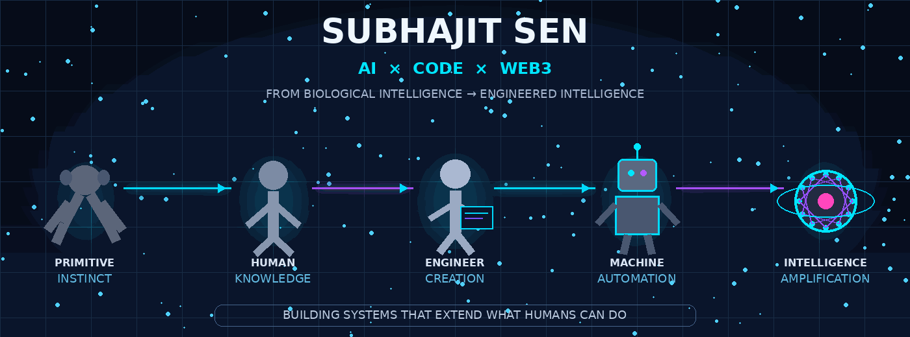

<div align="center">

<!-- ═══════════════════════════════════════════════════════════════ -->
<!--                         HERO SYSTEM                            -->
<!-- ═══════════════════════════════════════════════════════════════ -->



<br>


<br><br>

<a href="https://github.com/Subhajit054">

</a>
<a href="https://creative-vision-studio.vercel.app/">

</a>
<a href="https://www.linkedin.com/in/subhajit04sen">

</a>
<a href="https://leetcode.com/u/jitsubha04/">

</a>
<a href="https://www.kaggle.com/subhaji04">

</a>
<a href="mailto:jitsen5849@gmail.com">

</a>

<br><br>


</div>

<br>

---

# `> WHO_IS_SUBHAJIT`

<div align="center">

### 🧠 AI/ML ENGINEER
### ⚡ FULL-STACK ENGINEER
### ⛓️ BLOCKCHAIN BUILDER

<br>

**B.Tech CSE — Artificial Intelligence & Machine Learning**  
**Brainware University · 2023 — 2027**

</div>

<br>

> **I don't want to simply collect technologies.  
> I want to understand why they belong in a system — and then build something meaningful with them.**

I'm a Computer Science student focused on the intersection of:

```text
             ┌─────────────────────┐
             │   ARTIFICIAL        │
             │   INTELLIGENCE      │
             └──────────┬──────────┘
                        │
                        ▼
             ┌─────────────────────┐
             │     SOFTWARE        │
             │    ENGINEERING      │
             └──────────┬──────────┘
                        │
                        ▼
             ┌─────────────────────┐
             │     BLOCKCHAIN      │
             │       / WEB3        │
             └─────────────────────┘
