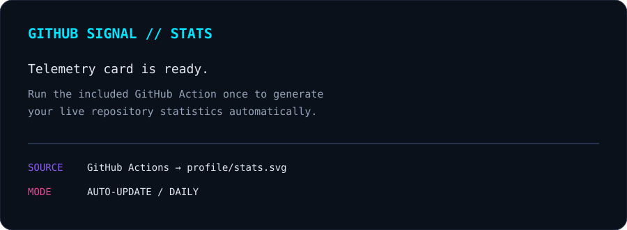
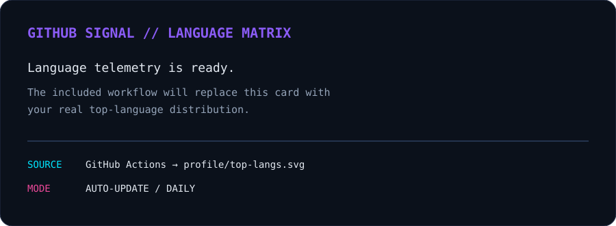

<div align="center">


<br/>

<a href="https://github.com/Subhajit054"></a>
<a href="https://creative-vision-studio.vercel.app/"></a>
<a href="https://www.linkedin.com/in/subhajit04sen"></a>
<a href="https://leetcode.com/u/jitsubha04/"></a>
<a href="https://www.kaggle.com/subhaji04"></a>
<a href="mailto:jitsen5849@gmail.com"></a>

<br/><br/>


</div>

<br/>

> **The goal isn't to collect technologies. The goal is to make every technology earn its place in a system.**

---

## `SYSTEM IDENTITY`

<table>
<tr>
<td width="58%" valign="top">

### **SUBHAJIT SEN**

**B.Tech CSE — Artificial Intelligence & Machine Learning**

I build at the intersection of **Artificial Intelligence, Software Engineering and Blockchain**.

My focus is on turning ideas into systems that are:

- 🧠 **Intelligent** — AI, ML, GenAI, RAG, Computer Vision
- ⚡ **Scalable** — full-stack engineering, APIs, cloud and deployment
- ⛓️ **Trust-aware** — blockchain, smart contracts and Web3
- 🧩 **System-driven** — DSA, architecture, trade-offs and engineering fundamentals

**Currently exploring:** LLM applications · RAG · embeddings · vector databases · computer vision · deep learning · full-stack systems · Web3

</td>
<td width="42%" align="center" valign="middle">


</td>
</tr>
</table>

---

## `NEURAL STACK`

<div align="center">


<br/>


</div>

---

## `BUILDS // PROJECT UNIVERSE`

<div align="center">

</div>

### 🩸 BloodGrid
**Emergency Blood Response OS** · `Blockchain × Healthcare × Real-Time`

A decentralized emergency blood-response concept connecting donors, hospitals, blood availability and emergency logistics.

**Core:** React · Web3 · Solidity · Smart Contracts · Maps · Real-Time Systems

### 🧠 MedSwap AI
**Prescription Understanding System** · `Computer Vision × NLP × Healthcare`

An AI-powered system designed to transform difficult prescriptions into structured and understandable medicine information.

**Core:** OCR · Vision AI · NLP · FastAPI · Medicine Understanding

### 🛰️ Satellite AI
**Satellite Image Intelligence** · `Deep Learning × Computer Vision`

A deep-learning project focused on understanding and classifying satellite imagery.

**Core:** Python · Deep Learning · Computer Vision · Image Classification

### 🔐 Decentralized Document Vault
**Digital Ownership Infrastructure** · `Blockchain × Security × Web3`

A decentralized architecture exploring ownership, verification and controlled document access.

**Core:** Blockchain · Smart Contracts · Web3

### 🎨 Crafts Marketplace
**Rural Digital Marketplace** · `Full-Stack × E-Commerce × Rural Innovation`

A marketplace concept designed to connect rural artisans with digital customers.

**Core:** Full-Stack Development · UI/UX · E-Commerce

<div align="center">
<a href="https://creative-vision-studio.vercel.app/"></a>
</div>

---

## `ENGINEERING MINDSET`

<div align="center">


<br/><br/>

### **AI gives systems intelligence.**  
### **Software gives them scale.**  
### **Blockchain gives them trust.**

</div>

---

## `GITHUB SIGNAL`

> **No more unreliable external telemetry images.** The cards below are stored inside this repository and updated automatically by GitHub Actions.

<div align="center">




</div>

The workflow in `.github/workflows/update-profile-stats.yml` regenerates these cards **daily** and can also be triggered manually from the **Actions** tab.

---

## `CURRENT TRAJECTORY`

```text
2023 ──► B.Tech CSE (AI & ML)
          │
2024 ──► Programming · Web Development · Software Fundamentals
          │
2025 ──► Machine Learning · Deep Learning · Computer Vision · Blockchain
          │
2026 ──► Generative AI · RAG · Full-Stack · System Engineering
          │
2027 ──► AI / Software Engineer
```

---

## `CONNECT`

<div align="center">

<a href="https://github.com/Subhajit054">GitHub</a> ·
<a href="https://creative-vision-studio.vercel.app/">Portfolio</a> ·
<a href="https://www.linkedin.com/in/subhajit04sen">LinkedIn</a> ·
<a href="https://leetcode.com/u/jitsubha04/">LeetCode</a> ·
<a href="https://www.kaggle.com/subhaji04">Kaggle</a> ·
<a href="mailto:jitsen5849@gmail.com">Email</a>

<br/><br/>

**BUILD → BREAK → LEARN → REBUILD → SHIP**

</div>

<br/>

<div align="center">

`AI` × `SOFTWARE` × `WEB3`

**The evolution is still running.**

</div>
